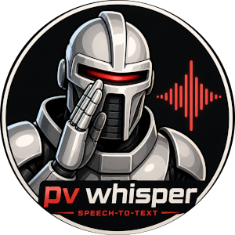

# PvWhisper

Yet another cross-platform Speech-to-Text console application.

Build using [dotnet](https://dotnet.microsoft.com/en-us/download), [PvRecorder](https://github.com/Picovoice/pvrecorder), [Whisper.net](https://github.com/sandrohanea/whisper.net), [ydotool](https://github.com/ReimuNotMoe/ydotool), and [JetBrains Junie](https://www.jetbrains.com/junie/), but you should really use [Claude Code](https://claude.com/product/claude-code).

Why make yet another Speech-to-Text program? It was fun, I wanted it to just run from a console without requiring any installs, and it supports multiple outputs.



## Features

- **Write to Console**
  - Prints transcribed Speech-to-Text to the console  
  - Works on Linux, Mac, and Windows

- **Write to Clipboard**
  - Copies transcribed Speech-to-Text to the system clipboard  
  - Works on Linux, Mac, and Windows

- **Write to Virtual Keyboard (ydotool)**
  - Types transcribed Speech-to-Text into a virtual keyboard  
  - Only available on Linux with [ydotool](https://github.com/ReimuNotMoe/ydotool)

- **Use any Whisper Model**
  - Multiple [Whisper Model](https://whisper-api.com/blog/models/) sizes supported
  - Automatically downloads models from [Hugging Face](https://huggingface.co/openai/models)

- **Toggle speech capture via HTTP**
  - Create a global shortcut to toggle speech capture via shell script
  - Works on Linux, Mac, and Windows

- **Text transformations with Regular Expressions**
  - Create any number of transform rules
  - Use plain text or regular expressions

## Getting Started

1. Install the [dotnet SDK 10.0](https://dotnet.microsoft.com/en-us/download)
2. Optional: ydotool and keyd (see sections below)
3. Clone this repository
4. Configure via `AppConfig.json`
5. Execute `run_pvw.sh`
6. Toggle capture by executing `toggle_pvw.sh`

## Configuration

Configure by updating the JSON values in the [AppConfig.json](https://github.com/tdupont750/PvWhisper/blob/main/AppConfig.json) file.

Supported Outputs:
- `Console`
- `Clipboard`
- `ydotool`

See source for [OutputTargets](https://github.com/tdupont750/PvWhisper/blob/main/src/PvWhisper/Config/OutputTarget.cs) and [ModelKinds](https://github.com/tdupont750/PvWhisper/blob/main/src/PvWhisper/Config/ModelKind.cs).

Text transformations run in the order provided.

## Commands

Console Commands:
- `v` = toggle capture (start/stop + transcribe)
- `c` = start capture
- `z` = stop capture and discard audio
- `x` = stop capture and transcribe
- `q` = quit

Via HTTP (when `httpPort` is set in `AppConfig.json`):
- `curl -s -X POST http://localhost:5042/command/v`   # toggle capture
- `curl -s -X POST http://localhost:5042/command/q`   # quit

## Optional Integrations

### ydotool

Adds support to type via virtual keyboard. *Only available on Linux.*

Instructions for installing ydotool taken from [this issue on official GitHub repository](https://github.com/ReimuNotMoe/ydotool/issues/285#issuecomment-3219166315).

```bash
sudo apt install cmake scdoc pkg-config

cd ~/Downloads/;
git clone https://github.com/ReimuNotMoe/ydotool.git && {
  cd ydotool; mkdir build; cd build && {
    cmake .. && make -j `nproc`;
  };
};
sudo make install;

# DO NOT INSTALL SERVICE
# systemctl daemon-reload;
# systemctl --user enable ydotoold;
# systemctl --user start ydotoold.service;
```

The service requires root, so run `start_ydotool.sh` before starting PvWhisper

### keyd

Adds support to override keyboard mappings. *Only available on Linux.*

Instructions for installing keyd taken from [official GitHub repository](https://github.com/rvaiya/keyd?tab=readme-ov-file#from-source).

```bash
git clone https://github.com/rvaiya/keyd
cd keyd
make && sudo make install
sudo systemctl enable --now keyd
```

My configuration (`/etc/keyd/default.conf`) remaps Caps Lock to a global shortcut that invokes toggle script (`toggle_pvw.sh`)

```
[ids]

*

[main]

capslock = macro(leftcontrol+leftalt+leftshift+v)

[control]

capslock = capslock
```

## License

Released under the GNU General Public License v3.0.
